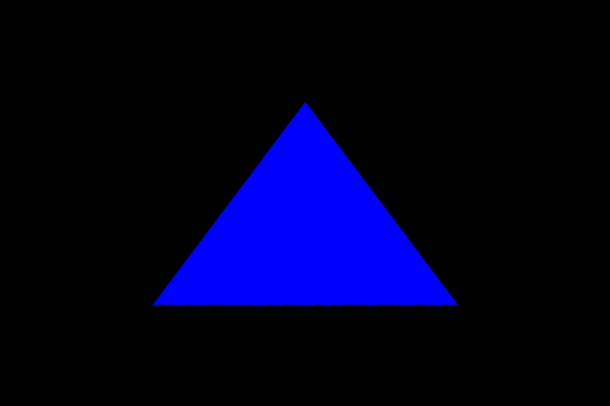

# Ray Triangle

## Description
##### This code ray traces a simple triangle and load Object from object.txt file

## Compilation
##### This requires SDL2 and SDL2 image library

#### Configure and build the project
###### make
###### ./build/debug/play

